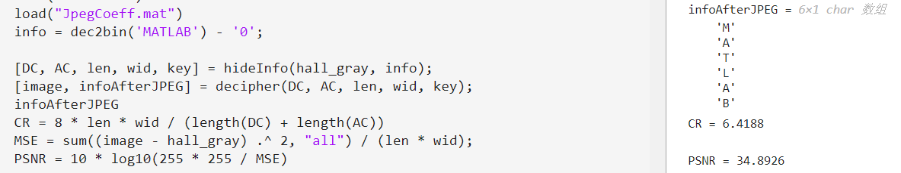

# 图像处理大作业作答及说明文档

> 无17 马林 2021010540

<span style="font-size: 24px;">_**注：为输出简洁起见，测试代码中很多部分在原程序中添加了分号，如果想要看到和文档中同样的输出结果，请自行去掉分号。**_</span>

## 第一部分练习题

<span style="font-size: 20px;">**2.(a)**</span>

添加如下代码：

```matlab
clear all
clc
load("hall.mat")
imshow(hall_color)
hall_color_copy = hall_color;
[length, width, n] = size(hall_color_copy);
r = min(length, width) / 2;
x0 = length / 2;
y0 = width / 2;
for len = 1: length
    for wid = 1: width
        dist = sqrt((len - x0) ^ 2 + (wid - y0) ^ 2);
        if abs(dist - r) < 1
            hall_color_copy(len, wid, 1) = 255;
            hall_color_copy(len, wid, 2) = 0;
            hall_color_copy(len, wid, 3) = 0;
        end
    end
end
imshow(hall_color_copy);
```

创建图像副本，避免原图被更改（后面类似的代码同理，不再赘述）。通过判断图像中某个像素点到图像中心的距离的绝对值是否小于1，来画出红色的圆，即 $(R, G, B)=(255, 0, 0)$ ，之所以是小于1，是希望画出的圆视觉上更为明显。

运行程序可得：


<span style="font-size: 20px;">**2.(b)**</span>

根据国际棋盘的样式：


通过观察可以得出，在行数与列数之和为奇数处棋盘颜色为黑，为偶数处棋盘为白。

添加如下代码：

```matlab
% 8 * 8 Chessboard
clear all
clc
load("hall.mat")
hall_color_copy = hall_color;
[length, width, ~] = size(hall_color_copy);
for len = 1: 8
    for wid = 1: 8
        if mod(len + wid, 2)
            hall_color_copy((len - 1) * length / 8 + 1: len * length / 8, (wid - 1) * width / 8 + 1: wid * width / 8, 1) = 0;
            hall_color_copy((len - 1) * length / 8 + 1: len * length / 8, (wid - 1) * width / 8 + 1: wid * width / 8, 2) = 0;
            hall_color_copy((len - 1) * length / 8 + 1: len * length / 8, (wid - 1) * width / 8 + 1: wid * width / 8, 3) = 0;
        end
    end
end
figure
imshow(hall_color_copy)
```

在为黑处令副本的 $(R, G, B)=(0, 0, 0)$ 即黑色。

运行程序可得：


## 第二部分练习题

<span style="font-size: 20px;">**1**</span>

由于DCT变换具有线性性，图像每个像素的灰度值先减去128，再作DCT变换，相当于图像先作DCT变换，然后让变换的结果减去全128阵（即矩阵中每个元素都是128）的DCT变换。基于此，截取原图中中间一部分图像（后面的题目，如有涉及，同样截取这段图像，不再赘述），添加如下代码：

```matlab
clear all
clc
load("hall.mat")
[length, width, ~] = size(hall_gray);
figure
imshow(hall_gray)

hall_center = hall_gray(length / 4: 3 * length / 4, width / 4: 3 * width / 4);

hall1 = double(hall_center) - 128 .* ones(size(hall_center));
hall1_dct = dct2(hall1);

[len_center, wid_center, ~] = size(hall_center);

hall2_dct = dct2(hall_center) - dct2(128 * ones(len_center, wid_center));
hall2 = idct2(hall2_dct);

mse1 = sum((hall1 - hall2) .^ 2, "all")
mse2 = sum((hall1_dct - hall2_dct) .^ 2, "all")

hall2 = hall2 + 128 .* ones(size(hall_center));
figure
subplot(1, 2, 1)
imshow(hall_center)
subplot(1, 2, 2)
imshow(uint8(hall2))
```

利用MSE指标（即相减结果的平方和）评判图像的相似性。运行程序可得：


可见图像及其二维DCT变换的MSE均很小，故可以在变换域上对图像进行预处理。


**左边为非变换域的处理结果，右边为变换域的处理结果。**可见肉眼对图片的直观感受也基本一样。

<span style="font-size: 20px;">**2**</span>

以课本式`(2.5)`为参照，首先实现D矩阵的计算，即函数`calD`，然后实现二维DCT变换，即函数`DCT2`：

```matlab
function D = calD(N)
    row = 1: 2: 2 * N - 1;
    col = 0: N - 1;
    temp = cos(col.' * row * pi / (2 * N));
    temp(1, :) = sqrt(1 / 2) * ones(1, N);
    D = temp .* sqrt(2 / N);
end

function res = DCT2(M)
    [dim1, dim2] = size(M);
    res = calD(dim1) * M * calD(dim2).';
end
```

在主程序中，同样利用MSE指标判断实现的相似性，添加如下代码：

```matlab
clear all
clc
load("hall.mat")

hall1 = double(hall_gray) - 128 .* ones(size(hall_gray));
hall1_dct = dct2(hall1);
hall1_DCT = DCT2(hall1);
mse = sum((hall1_DCT - hall1_dct) .^ 2, "all")
```

运行程序可得：


可见两种二维DCT变换的MSE很小，可以认为编程实现的二维DCT变换和库中的二维DCT变换基本一致。

<span style="font-size: 20px;">**3**</span>

由于DCT变换中右侧的系数主要代表横向变化的纹理的强度（当然也有纵向变化的纹理的强度等因素，但处在次要地位），左侧的系数主要代表横向的整体亮度（当然也有竖向的整体强度等因素，但处在次要地位）。将右侧四列全部置零后，图像左右的高频分量被剔除，左右突变不明显；将左侧四列全部置零后，图像左右的直流和低频分量被剔除，左右突变更加明显。添加如下代码：

```matlab
clear all
clc
load("hall.mat")
[length, width, ~] = size(hall_gray);
hall_center = hall_gray(length / 4: 3 * length / 4, width / 4: 3 * width / 4);

hall1 = double(hall_center) - 128 .* ones(size(hall_center));
hall1_dct = dct2(hall1);
rhall_dct = hall1_dct;
lhall_dct = hall1_dct;
rhall_dct(:, end - 3: end) = 0;
rhall = uint8(idct2(rhall_dct) + 128 .* ones(size(hall_center)));
lhall_dct(:, 1: 4) = 0;
lhall = uint8(idct2(lhall_dct) + 128 .* ones(size(hall_center)));
hall1 = hall1 + 128 .* ones(size(hall_center));

figure
subplot(1, 3, 1);
imshow(uint8(hall1))
subplot(1, 3, 2);
imshow(uint8(rhall))
subplot(1, 3, 3);
imshow(uint8(lhall))
```

运行程序可得：


**最左边为原图，中间的为DCT系数矩阵中最右侧四列的系数全部置零的图，最右边的为DCT系数矩阵中最左侧四列的系数全部置零的图。**可见，程序运行结果验证了我们的猜想。

<span style="font-size: 20px;">**4**</span>

DCT系数做转置，相当于原图中横向的直流分量和变化趋势与纵向的互换，即图像做了“转置”；DCT系数（逆时针）旋转90度，原来大的直流系数被旋转到纵向变化的纹理的强度，原来横向变化的纹理的强度被旋转到直流分量上，新的图像整体呈现色调偏暗的，纵向变化的纹理强度很大的模糊图像，无论从哪个角度看，图像失真都非常严重；DCT系数（逆时针）旋转180度，原来横纵向变化的纹理强度与直流分量的位置做了一个旋转式的交换，横向变化的纹理的强度与纵向变化的纹理的强度也做了一个旋转式的交换，新的图像整体应呈现很暗的色调，横纵向的纹理强度变化都很大，图像上会出现很多黑色或白色的近圆点，且图像失真严重，基本看不出原图形。

为验证上面的猜想，添加如下代码：

```matlab
clear all
clc
load("hall.mat")
[length, width, ~] = size(hall_gray);
hall_center = hall_gray(length / 4: 3 * length / 4, width / 4: 3 * width / 4);

hall = double(hall_center) - 128 .* ones(size(hall_center));
hall_dct = dct2(hall);
hallT_dct = hall_dct.';
hall90_dct = rot90(hall_dct);
hall180_dct = rot90(hall90_dct);
hall = uint8(hall + 128 .* ones(size(hall_center)));
hallT = uint8(idct2(hallT_dct) + 128 .* ones(size(hall_center.')));
hall90 = uint8(idct2(hall90_dct) + 128 .* ones(size(rot90(hall_center))));
hall180 = uint8(idct2(hall180_dct) + 128 .* ones(size(hall_center)));

figure
subplot(1, 4, 1);
imshow(hall)
subplot(1, 4, 2);
imshow(hallT)
subplot(1, 4, 3);
imshow(hall90)
subplot(1, 4, 4);
imshow(hall180)
```

运行程序可得：


**最左边为原图，第二张为DCT系数转置之后的图，第三张为DCT系数逆时针旋转$90^o$之后的图，最右边为DCT系数逆时针旋转$180^o$之后的图**。可见，程序运行结果与猜想基本一致。

<span style="font-size: 20px;">**5**</span>

根据课本中所给的差分编码的运算：
$$
\hat{c}_D(n)=
\begin{cases}
\tilde{c}_D(n) & n=1;\\
\tilde{c}_D(n-1)-\tilde{c}_D(n) & elsewhere
\end{cases}
$$
容易给出该系统的系统函数：
$$
H(z)=\frac{1-z}{z}
$$
显然这是一个高通系统，为验证这一点，添加如下代码，绘出该系统的频率响应：

```matlab
clear all
clc
z = [-1, 1];
p = 1;
figure
freqz(z, p)
```

运行程序可得：


这验证了我们的猜想。DC系数先进行差分编码再进行熵编码，而差分编码又是高通滤波器，说明DC系数的高频分量更多。

<span style="font-size: 20px;">**6**</span>

DC预测误差$\tilde{c}_D$ 的取值和Category之间的关系是：
$$
Category=ceil(log_2(|\tilde{c}_D|+1))
$$
据此即可由预测误差计算出其Category。

<span style="font-size: 20px;">**7**</span>

对于固定维度的矩阵，实现Zig-Zag扫描的一种很快的方法是查表法，即根据Zig-Zag扫描的轨迹，事前确定好扫描过后矩阵的索引，将其存在一个表格中，然后让原矩阵按照表格中所存的索引取出其值并构成一个新的矩阵，这个新的矩阵就是Zig-Zag扫描的结果。据此，新增如下函数：

```matlab
function res = zigzag(M)
    temp = reshape(M.', [1, 64]);
    a = [1, 2, 9, 17, 10, 3, 4, 11, 18, 25, 33, 26, 19, 12, 5, 6, ...
        13, 20, 27, 34, 41, 49, 42, 35, 28, 21, 14, 7, 8, 15, 22, 29, ...
        36, 43, 50, 57, 58, 51, 44, 37, 30, 23, 16, 24, 31, 38, 45, 52, ...
        59, 60, 53, 46, 39, 32, 40, 47, 54, 61, 62, 55, 48, 56, 63, 64];
    res = temp(a).';
end
```

并添加如下测试代码，程序输出结果应该就是定义的表格：

```matlab
clear all
clc
test = [1: 8; 9: 16; 17: 24; 25: 32;
        33: 40; 41: 48; 49: 56; 57: 64];
zigzag(test)
```

运行程序所得结果存在`2_7zigzagAns.mat`文件中，从文件中可以看到，输出结果正好就是定义的表格，这验证了函数的正确性。

<span style="font-size: 20px;">**8**</span>

对测试图像的处理流程是：先对图像进行预处理，然后利用`blockproc`函数对图像进行分块处理，对每一块图像，先进行二维DCT变换，然后将变换的结果对应地除以`JpegCoeff.mat`中的`QTAB`数据，并四舍五入取整，然后对取整的结果做Zig-Zag扫描，得到中间变量`image_block`。然后将中间变量`image_block`重排成题目所要求的形式即可，其中，由于Zig-Zag扫描得到的是`64 * 1`的向量，故行数为`image_block`的行数除以64，列数即`image_block`的列数。

据此，编写如下函数：

```matlab
function image_index = getImageIndex(image, QTAB)
    image_temp = double(image) - 128 .* ones(size(image));
    image_block = blockproc(image_temp, [8, 8], @(M) zigzag(round(dct2(M.data) ./ QTAB)));
    
    [len, wid, ~] = size(image_block);
    image_index = zeros([64, len * wid / 64]);
    for i = 1: len / 64
        image_index(:, (i - 1) * wid + 1: i * wid) = image_block(64 * (i - 1) + 1: 64 * i, :);
    end
end
```

并添加如下代码：

```matlab
clear all
clc
load("hall.mat")
load("JpegCoeff.mat")
hall_index = getImageIndex(hall_gray, QTAB);
```

程序运行结果中的`hall_index`值存在`2_8hall_index.mat`文件中。

<span style="font-size: 20px;">**9**</span>

图像高度和图像宽度直接根据`size`函数获得。至于DC系数和AC系数的码流，借助上一问实现的函数，在取得图像的`image_index`（即上一问函数的返回值）之后，首先求DC系数的码流。

先对量化后的直流分量（即`image_index`的第一行）做差分运算得到`DC_diff`，即预测误差，然后根据第六问得到的公式计算出`DC_category`，接着由映射关系索引出`DC_category`对应的`DC_Huffman`，至于数字的二进制表述，由`dec2bin`函数得到的字符矩阵减去全`'0'`矩阵即可，如果是负数，就对结果取1补码，即按位取反。

然后是AC系数的码流。

按照与DC类似的处理方式得到`AC_category`之后，由于量化后的交流分量无需进行差分运算，故直接用`AC_index`参与后续运算。定义好特殊的变量$ZRL=11111111001$ 和$EOB=1010$ ，然后由`sixteenTimes`记录每个AC块中行程`Run`中连续的16个0的次数。然后由映射关系索引出`AC_category`对应的`AC_Huffman`，数字的二进制表述与DC的处理方式相同。

在这里，对于文档中未特别限定的0的二进制表示，有00和000两种合适的表示方法，前者在码长方面显然有明显的优势，但是考虑到000的表示方式统一性更好，即也是按照$[Huffman,\  Magitude]$的方式编码，且随着Category的逐一递增，整体的熵编码码长也是逐一递增，并且在程序实现上有更清晰的逻辑，故在本程序中，选用000的编码方式对0进行编码。

基于上述内容，编写如下函数计算码流和图像的尺寸：

```matlab
function [DC, AC, height, width] = JPEG_encoding(image)
    load("JpegCoeff.mat")
    [height, width, ~] = size(image);
    image_index = getImageIndex(image, QTAB);
    
    DC_diff = [image_index(1, 1), image_index(1, 1: end - 1) - image_index(1, 2: end)];
    DC_category = min(ceil(log2(abs(DC_diff) + 1)), 11);
    
    DC = [];
    for i = 1: length(DC_diff)
	    DC_Huffman = DCTAB(DC_category(i) + 1, 2: DCTAB(DC_category(i) + 1, 1) + 1).';
	    DC_bin = (dec2bin(abs(DC_diff(i))) - '0').';
        if DC_diff(i) < 0
		    DC_bin = ~DC_bin;
        end
	    DC = [DC; DC_Huffman; DC_bin];
    end
    
    AC_index = image_index(2: end, :);
    AC_category = min(ceil(log2(abs(AC_index) + 1)), 10);

    ZRL = [1; 1; 1; 1; 1; 1; 1; 1; 0; 0; 1];
    EOB = [1; 0; 1; 0];
    [len, wid] = size(AC_category);
    AC = [];
    for i = 1: wid
        Run = 0;
        sixteenTimes = 0;
        for j = 1: len
            if AC_category(j, i) == 0
                Run = Run + 1;
                if Run == 16
                    sixteenTimes = sixteenTimes + 1;
                    Run = 0;
                end
            else
                while sixteenTimes > 0
                    AC = [AC; ZRL];
                    sixteenTimes = sixteenTimes - 1;
                end
                AC_Huffman = ACTAB(10 * Run + AC_category(j, i), 4: ACTAB(10 * Run + AC_category(j, i), 3) + 3).';
                AC_bin = (dec2bin(abs(AC_index(j, i))) - '0').';
                if AC_index(j, i) < 0
                    AC_bin = ~AC_bin;
                end
                AC = [AC; AC_Huffman; AC_bin];
                Run = 0;
            end
        end
        AC = [AC; EOB];
    end
end
```

并添加如下代码：

```matlab
clear all
clc
load("hall.mat")
[DC, AC, len, wid] = JPEG_encoding(hall_gray);
save("jpegcodes.mat", "DC", "AC", "len", "wid");
```

程序运行结果中的`DC` ，`AC`， `len`和`wid`的值存在题述的`jpegcodes.mat`文件中。

<span style="font-size: 20px;">**10**</span>

由于码流是二进制表示，故下面的计算均转换为二进制。一个像素点的像素取值范围是[0, 255]，需要8bit存储。添加如下代码：

```matlab
clear all
clc
load("hall.mat")

[DC, AC, len, wid] = JPEG_encoding(hall_gray);
CR = 8 * len * wid / (length(DC) + length(AC));
```

CR即所求的压缩比，运行程序可得：


<span style="font-size: 20px;">**11**</span>

解码流程与编码流程相反。具体地，首先从DC码中还原出`DC_index`，即第8问中Zig-Zag扫描之后的直流系数。

需要注意的是，从Huffman码解码出Category时，如果Category为0，即对应于0的编码情况，由第9问中编码对0的限定，这里解码时，直接让预测编码为0即可。对于其他情况，则根据Category确定出的位数，紧接着取出相应的二进制码，并将其转换为十进制即可。在得到所有的预测系数之后，反差分得到量化后的直流分量，为反Zig-Zag扫描和逆二维DCT变换做好准备。

然后是从AC码中还原出`AC_index`，即第8问中Zig-Zag扫描之后的交流系数。

对于交流系数，由于系数中存在ZRL和结束码EOB，因此需要多增加一些逻辑。仍然是首先定义好ZRL和EOB，然后，在判断语句中，首先判断最为特殊的结束码EOB，如果确为结束码，则转向下一组AC系数求解，在这里的两个参数`colCount`和`rowCount`分别控制处理的AC系数组数和正在处理的AC系数组中目前截取到的位置；在判断完EOB后，对另一个特殊的ZRL进行判断，如确为ZRL，则不做处理（因为在我们对`AC_index`进行初始化的时候，就是用的全0矩阵），最后是其他码，同样根据Huffman码解码出(Run/Size)，再取出相应的二进制码，并将其转换为十进制即可。由于量化后的交流分量无需进行差分运算，故最终循环所得，即为`AC_index`。

在合并完`DC_index`和`AC_index`之后，分别进行反量化，按大小为`64 * 1`的块进行Zig-Zag逆扫描和二维DCT逆变换，再由`uint8`输出，即可得到JPEG解码后的图像。

基于上述内容，编写Zig-Zag逆扫描函数和JEPG解码函数如下：

```matlab
function res = izigzag(M)
    a = [1, 2, 6, 7, 15, 16, 28, 29, 3, 5, 8, 14, 17, 27, 30, 43, ...
        4, 9, 13, 18, 26, 31, 42, 44, 10, 12, 19, 25, 32, 41, 45, 54, ...
        11, 20, 24, 33, 40, 46, 53, 55, 21, 23, 34, 39, 47, 52, 56, 61, ...
        22, 35, 38, 48, 51, 57, 60, 62, 36, 37, 49, 50, 58, 59, 63, 64];
    res = reshape(M(a), [8, 8]);
    res = res.';
end

function image = JPEG_decoding(DC, AC, len, wid)
    load("JpegCoeff.mat")
    ZRL = [1; 1; 1; 1; 1; 1; 1; 1; 0; 0; 1];
    EOB = [1; 0; 1; 0];
    
    DC_diff = zeros([len * wid / 64, 1]);
    index = 1;
    count = 1;
    i = 2;
    while i <= length(DC)
        for j = 1: size(DCTAB, 1)
            if isequal(DC(index: i), DCTAB(j, 2: DCTAB(j, 1) + 1)')
                if j == 1
                    DC_diff(count) = 0;
                    index = i + 2;
                    i = index;
                    count = count + 1;
                    break;
                else
                    DC_bin = DC(i + 1: i + j - 1)';
                    if DC_bin(1)
                        DC_diff(count) = bin2dec(char(DC_bin + '0'));
                    else
                        DC_diff(count) = -bin2dec(char(~DC_bin + '0'));
                    end
                    index = i + j;
                    i = index;
                    count = count + 1;
                    break;
                end
            end
        end
        i = i + 1;
    end
    
    DC_index = zeros(size(DC_diff));
    DC_index(1) = DC_diff(1);
    for i = 2: size(DC_index, 1)
        DC_index(i) = DC_index(i - 1) - DC_diff(i);
    end
    
    AC_index = zeros([63, len * wid / 64]);
    index = 1;
    rowCount = 1;
    colCount = 1;
    i = 2;
    while i <= length(AC)
        if isequal(AC(index: i), EOB)
            colCount = colCount + 1;
            rowCount = 1;
            index = i + 1;
            i = index;
        elseif isequal(AC(index: i), ZRL)
            rowCount = rowCount + 16;
            index = i + 1;
            i = index;
        else
            for j = 1: size(ACTAB, 1)
                if isequal(AC(index: i), ACTAB(j, 4: ACTAB(j, 3) + 3)')
                    rowCount = rowCount + ACTAB(j, 1);
                    AC_bin = AC(i + 1: i + ACTAB(j, 2))';
                    if AC_bin(1)
                        AC_index(rowCount, colCount) = bin2dec(char(AC_bin + '0'));
                    else
                        AC_index(rowCount, colCount) = -bin2dec(char(~AC_bin + '0'));
                    end
                    rowCount = rowCount + 1;
                    index = i + ACTAB(j, 2) + 1;
                    i = index;
                    break;
                end
            end
        end
        i = i + 1;
    end
    image_index = [DC_index'; AC_index];
    image_block = zeros([len * 8, wid / 8]);
    % 一次从image_index搬wid / 8(168 / 8 = 21)个块到image_block
    for i = 1: len / 8
	    image_block((i - 1) * 64 + 1: i * 64, :) = image_index(:, (i - 1) .* wid / 8 + 1: i * wid / 8);
    end
    
    image = uint8(blockproc(image_block, [64, 1], @(M)(idct2(izigzag(M.data) .* QTAB))) + 128);
end
```

并添加如下代码：

```matlab
clear all
clc
load("hall.mat")
load("jpegcodes.mat")

image = JPEG_decoding(DC, AC, len, wid);
figure
subplot(1, 2, 1);
imshow(hall_gray)
subplot(1, 2, 2);
imshow(image)

MSE = sum((image - hall_gray) .^ 2, "all") / (len * wid);
PSNR = 10 * log10(255 * 255 / MSE)
```

运行程序可得：


**左边为原图，右边为JPEG编解码之后得到的图。**可见，从主观的角度看，虽然解码后的图片的确丢失了部分信息，但是图像的清晰度仍然得到了保证。

从峰值信噪比（PSNR）来看，$PSNR = 34.89dB$​，对于位深为8bits的图像来说，处于有损数字图像压缩的典型值[30, 50]之中。

[参见维基百科：PSNR]: https://en.wikipedia.org/wiki/Peak_signal-to-noise_ratio

可见图像压缩是成功的。

<span style="font-size: 20px;">**12**</span>

量化步长减半，直接令原来的`QTAB`除以2即可，新函数`JPEG_encoding2`和`JPEG_decoding2`除此以外无任何不同，不再赘述。添加如下测试代码：

```matlab
clear all
clc
load("hall.mat")
load("jpegcodes.mat")

image1 = JPEG_decoding(DC, AC, len, wid);
[DC2, AC2, len2, wid2] = JPEG_encoding2(hall_gray);
image2 = JPEG_decoding2(DC2, AC2, len2, wid2);
figure
subplot(1, 3, 1);
imshow(hall_gray)
subplot(1, 3, 2);
imshow(image1)
subplot(1, 3, 3);
imshow(image2)

CR1 = 8 * len * wid / (length(DC) + length(AC))
CR2 = 8 * len2 * wid2 / (length(DC2) + length(AC2))

MSE1 = sum((image1 - hall_gray) .^ 2, "all") / (len * wid);
PSNR1 = 10 * log10(255 * 255 / MSE1)
MSE2 = sum((image2 - hall_gray) .^ 2, "all") / (len2 * wid2);
PSNR2 = 10 * log10(255 * 255 / MSE2)
```

运行程序可得：


可见，量化步长减半后，图像的压缩比降低，但图像质量（PSNR刻画）变高了。


**最左侧为原图，中间为原量化步长JPEG编解码得到的图，最右侧为量化步长减半后JPEG编解码得到的图**。从直观上看，量化步长减半后的图像，清晰度的确更高。

<span style="font-size: 20px;">**13**</span>

添加如下代码，对雪花图片进行处理：

```matlab
clear all
clc
load("snow.mat")
[DC, AC, len, wid] = JPEG_encoding(snow);
image = JPEG_decoding(DC, AC, len, wid);

CR = 8 * len * wid / (length(DC) + length(AC))
MSE = sum((image - snow) .^ 2, "all") / (len * wid);
PSNR = 10 * log10(255 * 255 / MSE)

figure
subplot(1, 2, 1);
imshow(snow)
subplot(1, 2, 2);
imshow(image)
```

运行程序可得：


可见，雪花图像的压缩比相较于测试图像更低，且图像质量更差，PSNR甚至不在典型值之列。


**左边是处理之前的雪花图像，右边是处理之后的雪花图像**。从直观感受上看，这两张图像几乎没有区别，可能是因为雪花图像中没有什么值得我们感兴趣的信息，并且人眼对快速变化的细节部分不太关注。不过，雪花图像的压缩比更低，图像质量更差可能是由于雪花图像中的高频分量较多，幅度较大，导致在JPEG编码的过程中很多高频分量丢失了，并且Category普遍较大，导致JPEG压缩不太理想，最后解码生成的图像也就不尽如人意了。

## 第三部分练习题

<span style="font-size: 20px;">**1**</span>

本次隐藏的信息为字符串`MATLAB`，在程序中以字符数组的方式呈现。首先利用`bitset`函数，将字符信息转换为二进制之后逐个存储到`hall_gray`之中，顺序是从`hall_gray`的第一个像素依次往后逐一递增。隐藏完毕后，用`bitget`函数配合`bitset`函数提取出像素即可。然后用第二部分完成的JPEG编解码程序对隐藏了信息的图像进行处理，然后按照同样的方法提取出信息。

基于上述思想，编写如下代码：

```matlab
clear all
clc
load("hall.mat")
hall = hall_gray;
info = dec2bin('MATLAB') - '0';
[len, wid, ~] = size(info);
for i = 1: len * wid
    hall(i) = bitset(hall(i), 1, info(i));
end

infoExtract = zeros([len, wid]);
for i = 1: len * wid
    infoExtract(i) = bitset(infoExtract(i), 1, bitget(hall(i), 1));
end
infoExtract = char(bin2dec(char(infoExtract + '0')))

[DC, AC, L, W] = JPEG_encoding(hall);
image = JPEG_decoding(DC, AC, L, W);
infoAfterJPEG = zeros([len, wid]);
for i = 1: len * wid
    infoAfterJPEG(i) = bitset(infoAfterJPEG(i), 1, bitget(image(i), 1));
end
infoAfterJPEG == info
infoAfterJPEG = char(bin2dec(char(infoAfterJPEG + '0')))

figure
subplot(1, 2, 1);
imshow(uint8(hall))
subplot(1, 2, 2);
imshow(hall_gray)
```

运行程序可得：


可见，在JPEG编解码之前，隐藏的信息可以顺利复原。但是在JPEG编解码之后，隐藏的信息基本无法复原，从`ans`中可以看到约50%的信息受到丢失，说明空域隐藏方法的抗JPEG编码能力很差，这可能是由于图像经过JPEG有损压缩之后，隐藏的信息就被当作高频分量而被舍弃了。不过不经过JPEG编码时：


从图像上看，几乎看不出任何隐藏信息的迹象，说明空域隐藏有一点的应用场景。

<span style="font-size: 20px;">**2.(1)**</span>

同样令此次隐藏的信息为`MATLAB`，不过，由于每个量化后的DCT系数的最低位都需要被信息位替换，故让隐藏的信息为`MATLAB`的周期重复，重复方式为从左到右从上到下的二进制信息隐藏，重复次数为：
$$
T=\frac{120\times168}{42}=480
$$
其中，42为字符串`MATLAB`用二进制编码表示的长度。

基于此，添加如下代码对信息进行隐藏：

```matlab
info = dec2bin('MATLAB') - '0';

image_temp = double(hall_gray) - 128 .* ones(size(hall_gray));
image_block = blockproc(image_temp, [8, 8], @(M) round(dct2(M.data) ./ QTAB));
[len, wid, ~] = size(info);
[len1, wid1, ~] = size(hall_gray);
dis = len1 * wid1 / len / wid;
for i = 0: len * wid - 1
    for j = 1: len * wid: len1 * wid1
        image_block(i + j) = bitset(abs(image_block(i + j)), 1, info(i + 1));
    end
end
image_block = blockproc(image_block, [8, 8], @(M) zigzag(M.data));

image_block = blockproc(image_block, [64, 1], @(M)(izigzag(M.data)));
[len, wid, ~] = size(info);
infoAfterJPEG = zeros([len, wid]);
res = [];
i = 0;
while i < dis
    for j = 1: len * wid
        bitget(image_block(j + i * len * wid), 1);
        infoAfterJPEG(j) = bitset(infoAfterJPEG(j), 1, bitget(image_block(j + i * len * wid), 1));
        temp = char(bin2dec(char(infoAfterJPEG + '0')));
    end
    res = [res, temp];
    i = i + 1;
end
res

image = uint8(blockproc(image_block, [8, 8], @(M)(idct2(M.data .* QTAB))) + 128);
[len, wid, ~] = size(hall_gray);
CR = 8 * len * wid / (length(DC) + length(AC))
MSE = sum((image - hall_gray) .^ 2, "all") / (len * wid);
PSNR = 10 * log10(255 * 255 / MSE)
```

剩下的JPEG编解码与第二部分的相同，不再赘述（后面两问亦如是），完整代码见zip包中的`imageProc.mlx`文件。运行程序可得：


可见，隐藏的信息被完美地提取了出来，没有任何丢失。不过，图像的压缩比约减半，且峰值信噪比PSNR未达到有损图像压缩的典型值之间。从直观上看：


图像失真十分严重，并且一眼能看出空间上的周期性，从而推断出有信息隐藏。可见，这种方式虽然可以完美提取出隐藏的信息，但是嵌密方法的隐蔽性太差，嵌密后的JPEG图像质量变差严重，且压缩比下降很多。

<span style="font-size: 20px;">**2.(2)**</span>

同样令此次隐藏的信息为`MATLAB`，且仅隐藏一次。隐藏方式同样为从左到右从上到下的二进制信息隐藏。基于此，添加如下代码：

```matlab
info = dec2bin('MATLAB') - '0';

image_temp = double(hall_gray) - 128 .* ones(size(hall_gray));
image_block = blockproc(image_temp, [8, 8], @(M) round(dct2(M.data) ./ QTAB));
[len, wid, ~] = size(info);
for i = 1: len * wid
    image_block(i) = bitset(abs(image_block(i)), 1, info(i));
end

image_block = blockproc(image_block, [64, 1], @(M)(izigzag(M.data)));
[len, wid, ~] = size(info);
infoAfterJPEG = zeros([len, wid]);
for i = 1: len * wid
    infoAfterJPEG(i) = bitset(infoAfterJPEG(i), 1, bitget(image_block(i), 1));
end
infoAfterJPEG = char(bin2dec(char(infoAfterJPEG + '0')))

image = uint8(blockproc(image_block, [8, 8], @(M)(idct2(M.data .* QTAB))) + 128);
[len, wid, ~] = size(hall_gray);
CR = 8 * len * wid / (length(DC) + length(AC))
MSE = sum((image - hall_gray) .^ 2, "all") / (len * wid);
PSNR = 10 * log10(255 * 255 / MSE)
```

运行程序可得：


可见，隐藏的信息被完美地提取了出来，没有任何丢失。并且，相比于每个量化后的DCT系数的最低位都隐藏信息，只隐藏若干量化后的DCT系数的最低位JPEG编解码之后的图像的压缩比约是前者的一倍，且峰值信噪比PSNR达到了有损图像压缩的典型值之间。从直观上看：


隐藏信息后的图像除了在隐藏信息部分的左上角可见有明显的空间周期性外，其余位置与原图像几乎没有区别。可见，这种隐藏方式不仅可以完美提取出隐藏的信息，嵌密方法还有较好的隐蔽性，嵌密后JPEG图像的质量也差强人意，压缩比相较于不隐藏信息的6.4188（见第二部分的第10问）也没有太大变化。不过，这种隐藏方法也有其缺点，一个是可以数据隐藏量很小，在本例中，量化后的DCT系数利用率只有$\frac{1}{480}$；另一个是在隐藏的部分，仔细观察的话仍可见一定的空间周期性，对有心人来说，信息还是不能得到很好的隐藏。

<span style="font-size: 20px;">**2.(3)**</span>

由于在本题中规定了待隐藏信息为1和-1的序列表示，故认为我们所接受到的仅是1和-1的序列编码，具体地解码还有对应的码表可查。因此，仅生成大小为$\frac{120\times168}{64}=315$随机1、-1序列作为待隐藏的信息，其中，分子为图像的尺寸，分母为Zig-Zag扫描的块大小。基于此，添加如下代码：

```matlab
image_temp = double(hall_gray) - 128 .* ones(size(hall_gray));
image_block = blockproc(image_temp, [8, 8], @(M) zigzag(round(dct2(M.data) ./ QTAB)));
[len, wid, ~] = size(image_block);

info = rand([len * wid / 64, 1]);
info(info >= 0.5) = 1;
info(info < 0.5) = -1;
j = 0;
for i = 1: len * wid / 64
    while image_block(64 * i - j) == 0
        j = j + 1;
    end
    image_block(64 * i - j) = info(i);
    j = 0;
end

[len, wid, ~] = size(image_block);
infoAfterJPEG = zeros([len * wid / 64, 1]);
j = 0;
for i = 1: len * wid / 64
    while image_block(64 * i - j) == 0
        j = j + 1;
    end
    infoAfterJPEG(i) = image_block(64 * i - j);
    j = 0;
end
isequal(infoAfterJPEG, info)

image = uint8(blockproc(image_block, [64, 1], @(M)(idct2(izigzag(M.data) .* QTAB))) + 128);
[len, wid, ~] = size(hall_gray);
CR = 8 * len * wid / (length(DC) + length(AC))
MSE = sum((image - hall_gray) .^ 2, "all") / (len * wid);
PSNR = 10 * log10(255 * 255 / MSE)
```

运行程序可得：


可见，这种方法同样可以将隐藏的信息完美地提取出来，没有任何丢失。并且，相比于每个量化后的DCT系数的最低位都隐藏信息，每个块Zig-Zag顺序的最后一个非零DCT系数隐藏信息后的图像的压缩比约是前者的2倍，且峰值信噪比PSNR达到了有损图像压缩的典型值之间。从直观上看：


隐藏信息后的图像可见比较明显的空间周期性矩形，在颜色较深处尤其如此。可见，这种隐藏方式虽然可以完美提取出隐藏的信息，但是嵌密方法的隐蔽性较差，不过嵌密后JPEG图像的质量还算差强人意，并且相较于第一种方式，质量有着明显的提升，压缩比相较于不隐藏信息的6.4188（见第二部分的第10问）也没有太大变化。另外，这种隐藏方法的数据隐藏量介于第一种方式和第二种方式之间，算是对这两种方式的一种权衡。

<span style="font-size: 20px;">**3**</span>

我们注意到，在量化后的`image_block`中本身是存在很多的0、1的，而我们的信息本身也是0、1组成的码流，我们可以利用这一点，在`image_block`中本身为0的地方就存0，本身为1的地方就存1，这样的话，可以预见，加密后的图像与原图像一定没有任何区别，且一定是抗JPEG编码的。不过，我们需要保存一个密钥，以便破解这份信息，这份密钥本质上就是一个索引。基于此，编写如下的附带JPEG编解码的加解密函数，`key`便是关键的密钥：

```matlab
function [DC, AC, len, wid, key] = hideInfo(image, info)
    load("JpegCoeff.mat")
    image_temp = double(image) - 128 .* ones(size(image));
    image_block = blockproc(image_temp, [8, 8], @(M) round(dct2(M.data) ./ QTAB));
    key = false(size(image_block));
    [len, wid, ~] = size(info);
    i = 1;
    j = 1;
    while j <= len * wid
        if image_block(i) == info(j)
            image_block(i) = bitset(abs(image_block(i)), 1, info(j));
            key(i) = true;
            j = j + 1;
        end
        i = i + 1;
    end
    
    image_block = blockproc(image_block, [8, 8], @(M) zigzag(M.data));
    
    [len, wid, ~] = size(image_block);
    image_index = zeros([64, len * wid / 64]);
    for i = 1: len / 64
        image_index(:, (i - 1) * wid + 1: i * wid) = image_block(64 * (i - 1) + 1: 64 * i, :);
    end
    
    DC_diff = [image_index(1, 1), image_index(1, 1: end - 1) - image_index(1, 2: end)];
    DC_category = min(ceil(log2(abs(DC_diff) + 1)), 11);
    
    DC = [];
    for i = 1: length(DC_diff)
        DC_Huffman = DCTAB(DC_category(i) + 1, 2: DCTAB(DC_category(i) + 1, 1) + 1).';
        DC_bin = (dec2bin(abs(DC_diff(i))) - '0').';
        if DC_diff(i) < 0
	        DC_bin = ~DC_bin;
        end
        DC = [DC; DC_Huffman; DC_bin];
    end
    
    AC_index = image_index(2: end, :);
    AC_category = min(ceil(log2(abs(AC_index) + 1)), 10);
    
    ZRL = [1; 1; 1; 1; 1; 1; 1; 1; 0; 0; 1];
    EOB = [1; 0; 1; 0];
    [len, wid] = size(AC_category);
    AC = [];
    for i = 1: wid
        Run = 0;
        sixteenTimes = 0;
        for j = 1: len
            if AC_category(j, i) == 0
                Run = Run + 1;
                if Run == 16
                    sixteenTimes = sixteenTimes + 1;
                    Run = 0;
                end
            else
                while sixteenTimes > 0
                    AC = [AC; ZRL];
                    sixteenTimes = sixteenTimes - 1;
                end
                AC_Huffman = ACTAB(10 * Run + AC_category(j, i), 4: ACTAB(10 * Run + AC_category(j, i), 3) + 3).';
                AC_bin = (dec2bin(abs(AC_index(j, i))) - '0').';
                if AC_index(j, i) < 0
                    AC_bin = ~AC_bin;
                end
                AC = [AC; AC_Huffman; AC_bin];
                Run = 0;
            end
        end
        AC = [AC; EOB];
    end
    [len, wid, ~] = size(image);
end

function [image, info] = decipher(DC, AC, len, wid, key)
    load("JpegCoeff.mat")
    DC_diff = zeros([len * wid / 64, 1]);
    index = 1;
    count = 1;
    i = 2;
    ZRL = [1; 1; 1; 1; 1; 1; 1; 1; 0; 0; 1];
    EOB = [1; 0; 1; 0];
    while i <= length(DC)
        for j = 1: size(DCTAB, 1)
            if isequal(DC(index: i), DCTAB(j, 2: DCTAB(j, 1) + 1)')
                if j == 1
                    DC_diff(count) = 0;
                    index = i + 2;
                    i = index;
                    count = count + 1;
                    break;
                else
                    DC_bin = DC(i + 1: i + j - 1)';
                    if DC_bin(1)
                        DC_diff(count) = bin2dec(char(DC_bin + '0'));
                    else
                        DC_diff(count) = -bin2dec(char(~DC_bin + '0'));
                    end
                    index = i + j;
                    i = index;
                    count = count + 1;
                    break;
                end
            end
        end
        i = i + 1;
    end
    
    DC_index = zeros(size(DC_diff));
    DC_index(1) = DC_diff(1);
    for i = 2: size(DC_index, 1)
        DC_index(i) = DC_index(i - 1) - DC_diff(i);
    end
    
    AC_index = zeros([63, len * wid / 64]);
    index = 1;
    rowCount = 1;
    colCount = 1;
    i = 2;
    while i <= length(AC)
        if isequal(AC(index: i), EOB)
            colCount = colCount + 1;
            rowCount = 1;
            index = i + 1;
            i = index;
        elseif isequal(AC(index: i), ZRL)
            rowCount = rowCount + 16;
            index = i + 1;
            i = index;
        else
            for j = 1: size(ACTAB, 1)
                if isequal(AC(index: i), ACTAB(j, 4: ACTAB(j, 3) + 3)')
                    rowCount = rowCount + ACTAB(j, 1);
                    AC_bin = AC(i + 1: i + ACTAB(j, 2))';
                    if AC_bin(1)
                        AC_index(rowCount, colCount) = bin2dec(char(AC_bin + '0'));
                    else
                        AC_index(rowCount, colCount) = -bin2dec(char(~AC_bin + '0'));
                    end
                    rowCount = rowCount + 1;
                    index = i + ACTAB(j, 2) + 1;
                    i = index;
                    break;
                end
            end
        end
        i = i + 1;
    end
    image_index = [DC_index'; AC_index];
    image_block = zeros([len * 8, wid / 8]);
    % 一次从image_index搬wid / 8(168 / 8 = 21)个块到image_block
    for i = 1: len / 8
        image_block((i - 1) * 64 + 1: i * 64, :) = image_index(:, (i - 1) .* wid / 8 + 1: i * wid / 8);
    end
    
    image_block = blockproc(image_block, [64, 1], @(M)(izigzag(M.data)));
    [len, wid, ~] = size(key);
    info = zeros([len, wid]);
    i = 1;
    j = 1;
    while i <= len * wid
        if key(i)
            info(j) = bitset(info(j), 1, bitget(image_block(i), 1));
            j = j + 1;
        end
        i = i + 1;
    end
    info = char(bin2dec(char(reshape(info(1: j - 1), [], 7) + '0')));
    
    image = uint8(blockproc(image_block, [8, 8], @(M)(idct2(M.data .* QTAB))) + 128);
end
```

运行程序可得：



可见，隐藏的信息被完美地提取了出来，且压缩比和峰值信噪比PSNR与不隐藏任何信息的JPEG编解码是相同的，这与我们的预期相符。

从直观上看：


隐藏了信息的JPEG编解码图片和只进行JPEG编解码看不出任何区别，嵌密方法的隐蔽性很好，这也与我们的预期相同。

不过，虽然这种方法有着显而易见的优势，但其一个很大的弊端就是受制于密钥，没有密钥的话，图片中的信息是无法被提取出来的，一旦密钥在传输的过程中受到严重噪声的影响丢失或是被侦破，那么图片中隐藏的信息也就一并丢失了。

## 第四部分练习题

<span style="font-size: 20px;">**1.(a)**</span>

不需要将训练样本调整为相同大小，原因是我们选取的特征是用不同颜色的比例构成的矢量作为确定人脸的标准，这与训练样本本身的大小无关。

<span style="font-size: 20px;">**1.(b)**</span>

为得知L分别取3,4,5时，所得的人脸特征有何区别，首先需要得到训练集的人脸特征向量。为此，首先求出$u(R_i)$ 。根据定义，$u(R_i)$ 是颜色出现频率构成的向量，而颜色出现的频率是颜色的像素点数占区域内总像素点数的比例，据此，先针对单张的人脸图片，通过遍历每一个像素点，累和出某一种颜色的比例，组合起来，就是$u(R_i)$ 。不过，由于我们需要减少颜色种类，故在累和之前，需要先对颜色的范围做一个缩减，以便缩减后的颜色范围能满足要求，缩减的方式由L决定。据此，编写如下函数：

```matlab
function u = getFeature(face, L)
    face = double(face);
    u = zeros([1, 2 ^ (3 * L)]);
    [len, wid, ~] = size(face);
    for j = 1: len
       for k = 1: wid
        R = floor(face(j, k, 1) * 2 ^ (L - 8));
        G = floor(face(j, k, 2) * 2 ^ (L - 8));
        B = floor(face(j, k, 3) * 2 ^ (L - 8));
        n = R * 2 ^ (2 * L) + G * 2 ^ L + B;
        u(n + 1) = u(n + 1) + 1;
       end
    end
    u = u / len / wid;
end
```

变量名称与文档中的名称相对应，含义也相同，函数最终的输出结果就是$u(R_i)$ 。

在得到$u(R_i)$之后，对其累和再求平均即可：

```matlab
function v = faceFeature(num, L)
    v = zeros([1, 2 ^ (3 * L)]);
    for i = 1: num
        face = imread("Faces\" + string(i) + ".bmp");
        v = v + getFeature(face, L);
    end
    v = v / num;
end
```

添加如下测试代码：

```matlab
clear all;
clc;
num = 33;
feature3 = faceFeature(num, 3);
feature4 = faceFeature(num, 4);
feature5 = faceFeature(num, 5);

figure
subplot(3, 1, 1);
plot(0: 2 ^ (3 * 3) - 1, feature3)
title("L = 3");
subplot(3, 1, 2);
plot(0: 2 ^ (3 * 4) - 1, feature4);
title("L = 4");
subplot(3, 1, 3);
plot(0: 2 ^ (3 * 5) - 1, feature5);
title("L = 5");
```

运行程序可得：


可见，随着L值的增大，特征向量的分辨能力越来越强，与此同时，作为代价，运算的时间成本越来越高，不过人脸的主要特征的趋势还是一样的。

<span style="font-size: 20px;">**2**</span>

为实现人脸识别的目标，首先选择合适大小的块`blockSize`遍历图像，遍历步长为`pace`，为一输入参数，以此确定人脸位置，并记录块的位置，同时，以一个变量`mark`作为该块是否作为最终被显示的块，初始时`mark`均置位1，代表最终将会显示；然后，以步长为标准，将距离靠近的块整合为合适的大小，具体地，为1.5倍的人脸面积，人脸面积由输入参数`faceSize`决定，并将被整合的块的`mark`置位0，代表最终不会显示。由于这种遍历方法在会使得框的位置稍偏左偏上，因此在整合之后需对框的位置以`pace`为基本单元做一定的微调，同时，为减小后续的遍历大小，将`mark`为0对应的块从之后的遍历单元中清除；之后，将识别到同一张人脸的多个块进行去重，同样以`pace`为基本单元，另外，在这一步同时处理可能出现的“框中框”问题。在进行完上面的步骤后，根据`mark`和剩余的块的位置，将对应区域标红，最终就得到了识别了人脸的图像。据此，设计如下函数：

```matlab
function img = faceRecognition(face, L, faceSize, blockSize, pace, e, num)
    [len, wid, ~] = size(face);
    xRight = [];
    yTop = [];
    mark = [];
    feature = faceFeature(num, L);
    i = blockSize;
    while i <= len
        j = blockSize;
        while j <= wid
            u = getFeature(face(i - blockSize + 1: i, j - blockSize + 1: j, :), L);
            d = 1 - sum(sqrt(u .* feature));
            if d < e
                xRight = [xRight, i];
                yTop = [yTop, j];
                mark = [mark, 1];
            end
            j = j + pace;
        end
        i = i + pace;
    end
    xLeft = xRight - blockSize + 1;
    yBottom = yTop - blockSize + 1;
    
    for i = 1: length(mark) - 1
        for j = i + 1: length(mark)
            if mark(j)
                if (abs(xLeft(i) - xLeft(j)) <= pace || abs(xRight(i) - xRight(j)) <= pace) && ...
                        (abs(yBottom(i) - yBottom(j)) <= pace || abs(yTop(i) - yTop(j)) <= pace)
                    minXLeft = min(xLeft(i), xLeft(j));
                    minYBottom = min(yBottom(i), yBottom(j));
                    maxXRight = max(xRight(i), xRight(j));
                    maxYTop = max(yTop(i), yTop(j));
                    area = 1.5 * faceSize * faceSize;
                    if (maxYTop - minYBottom) * (maxXRight - minXLeft) < area
                        mark(j) = 0;
                        xLeft(i) = minXLeft;
                        yBottom(i) = minYBottom;
                        xRight(i) = maxXRight;
                        yTop(i) = maxYTop;
                    end
                end
            end
        end
    end
    
    xLeft = xLeft(mark == 1) + 2 * pace;
    yBottom = max(yBottom(mark == 1) + 1 * pace, 1);
    xRight = min(xRight(mark == 1) + 6 * pace, len);
    yTop = yTop(mark == 1) - 4 * pace;
    mark = mark(mark == 1);
    
    for i = 1: length(mark) - 1
        for j = i + 1: length(mark)
            if ((abs(xLeft(i) - xLeft(j)) <= 6 * pace || xLeft(j) > xLeft(i)) &&...
                (abs(xRight(i) - xRight(j)) <= 6 * pace || xRight(j) < xRight(i)) && ...
                (abs(yBottom(i) - yBottom(j)) <= 6 * pace || yBottom(j) > yBottom(i)) && ...
                (abs(yTop(i) - yTop(j)) <= 6 * pace || yTop(j) < yTop(i)))
                mark(j) = 0;
            end
        end
    end
    
    redBox = false(size(face));
    w = 1;
    for i = 1: length(mark)
        if mark(i)
            redBox(xLeft(i) - w: xLeft(i) + w, yBottom(i) : yTop(i), 1) = true;
            redBox(xRight(i) - w: min(len, xRight(i) + w), yBottom(i) : yTop(i), 1) = true;
            redBox(xLeft(i): xRight(i), yBottom(i) - w: yBottom(i) + w, 1) = true;
            redBox(xLeft(i): xRight(i), yTop(i) - w: yTop(i) + w, 1) = true;
        end
    end
    face(redBox) = 255;
    img = face;
end
```

选择不同的L值，并注意到L的值越大，细节越丰富这一事实，适当增大阈值以增加人脸判别的准确性。利用1927年索尔维会议的部分合照：


添加如下测试代码：

```matlab
clear all;
clc;
face = imread("test.jpg");

faceSize = 75;
blockSize = 55;
pace = 5;
L = 3;
e = 0.25;
% faceRecognition(face, L, faceSize, blockSize, pace, e, num)
face3 = faceRecognition(face, 3, 75, 55, 5, 0.25, 33);
face4 = faceRecognition(face, 4, 75, 55, 5, 0.35, 33);
face5 = faceRecognition(face, 5, 75, 55, 5, 0.5, 33);
figure
subplot(1, 3, 1);
imshow(face3)
title("L = 3");
subplot(1, 3, 2);
imshow(face4)
title("L = 4");
subplot(1, 3, 3);
imshow(face5)
title("L = 5");
```

运行程序可得：


可见，所有人脸均得到了准确的识别。（建议在实时脚本中实际运行程序并放大观察图片，并排显示结果略有不清晰）

<span style="font-size: 20px;">**3**</span>

选择L值为3进行完成本题。注意到第二小问中要求将图像拉宽再进行识别，这对原有的处理方形脸轮廓的算法来说不太适合，为此，编写新的函数，使得算法可以对不规则的非正常图片（如脸被拉长或压扁等现象）进行人脸识别，代价是需要输入更多的参数以确定块大小和人脸大小：

```matlab
function img = faceRecognition2(face, L, faceLen, faceWid, blockLen, blockWid, pace, e, num)
    [len, wid, ~] = size(face);
    xRight = [];
    yTop = [];
    mark = [];
    feature = faceFeature(num, L);
    i = blockLen;
    rate = faceWid / faceLen;
    intRate = round(rate);
    while i <= len
        j = blockWid;
        while j <= wid
            u = getFeature(face(i - blockLen + 1: i, j - blockWid + 1: j, :), L);
            d = 1 - sum(sqrt(u .* feature));
            if d < e
                xRight = [xRight, i];
                yTop = [yTop, j];
                mark = [mark, 1];
            end
            j = j + pace;
        end
        i = i + pace;
    end
    xLeft = xRight - blockLen + 1;
    yBottom = yTop - blockWid + 1;
    
    for i = 1: length(mark) - 1
        for j = i + 1: length(mark)
            if mark(j)
                if (abs(xLeft(i) - xLeft(j)) <= pace || abs(xRight(i) - xRight(j)) <= pace) && ...
                        (abs(yBottom(i) - yBottom(j)) <= rate * pace || abs(yTop(i) - yTop(j)) <= rate * pace)
                    minXLeft = min(xLeft(i), xLeft(j));
                    minYBottom = min(yBottom(i), yBottom(j));
                    maxXRight = max(xRight(i), xRight(j));
                    maxYTop = max(yTop(i), yTop(j));
                    area = 1.5 * faceLen * faceWid;
                    if (maxYTop - minYBottom) * (maxXRight - minXLeft) < area
                        mark(j) = 0;
                        xLeft(i) = minXLeft;
                        yBottom(i) = minYBottom;
                        xRight(i) = maxXRight;
                        yTop(i) = maxYTop;
                    end
                end
            end
        end
    end
    
    xLeft = xLeft(mark == 1) + 2 * pace;
    yBottom = max(yBottom(mark == 1) + intRate * pace, 1);
    xRight = min(xRight(mark == 1) + 6 * pace, len);
    yTop = yTop(mark == 1) - 4 * intRate * pace;
    mark = mark(mark == 1);
    
    for i = 1: length(mark) - 1
        for j = i + 1: length(mark)
            if ((abs(xLeft(i) - xLeft(j)) <= 6 * pace || xLeft(j) > xLeft(i)) &&...
                (abs(xRight(i) - xRight(j)) <= 6 * pace || xRight(j) < xRight(i)) && ...
                (abs(yBottom(i) - yBottom(j)) <= 6 * rate * pace || yBottom(j) > yBottom(i)) && ...
                (abs(yTop(i) - yTop(j)) <= 6 * rate * pace || yTop(j) < yTop(i)))
                mark(j) = 0;
            end
        end
    end
    
    redBox = false(size(face));
    w = 1;
    for i = 1: length(mark)
        if mark(i)
            redBox(xLeft(i) - w: xLeft(i) + w, yBottom(i) : yTop(i), 1) = true;
            redBox(xRight(i) - w: min(len, xRight(i) + w), yBottom(i) : yTop(i), 1) = true;
            redBox(xLeft(i): xRight(i), yBottom(i) - w: yBottom(i) + w, 1) = true;
            redBox(xLeft(i): xRight(i), yTop(i) - w: yTop(i) + w, 1) = true;
        end
    end
    face(redBox) = 255;
    img = face;
end
```

算法的基本原理与上一问类似，不再赘述。在实现这个函数的基础上，根据文档中的提示，添加如下测试代码：

```matlab
clear all;
clc;
face = imread("test.jpg");

[len, wid, ~] = size(face);
faceSize = 75;
blockSize = 55;
pace = 5;
L = 3;
e = 0.25;
% faceRecognition(face, L, faceSize, blockSize, pace, e, num)
face90 = imrotate(face, -90);
face90 = faceRecognition(face90, 3, 75, 55, 5, 0.25, 33);

% faceRecognition2(face, L, faceLen, faceWid, blockLen, blockWid, pace, e, num)
face2Wid = imresize(face, [len, 2 * wid]);
face2Wid = faceRecognition2(face2Wid, 3, 75, 150, 55, 110, 5, 0.25, 33);

faceColor = imadjust(face, [0.2, 0.3, 0; 0.6, 0.7, 1]);
faceColor = faceRecognition(faceColor, 3, 75, 55, 5, 0.5, 33);

figure
subplot(1, 3, 1);
imshow(face90)
title("ClockWise Rotation")
subplot(1, 3, 2);
imshow(face2Wid)
title("Double the width")
subplot(1, 3, 3);
imshow(faceColor)
title("Change the Contrast Ratio")
```

运行程序可得：


可见，除了在第一张图片中，德布罗意没有被识别出来以外（在此声明，本人对图中的每一个科学家平等地尊重，未识别出的人脸纯因算法所致，绝非个人情感因素），图片的前两种变换算法均能较好地适应。然而，当图像的对比度发生改变后，在本人刻意调高阈值以希冀算法仍可以正常运行时，人脸识别仍然一塌糊涂，可见，算法对颜色的稳定性极差，对于变色的图像基本无法做出正确的判别。

<span style="font-size: 20px;">**4**</span>

如果可以重新选择人脸样本训练标准，绝对不应该选择颜色作为唯一标准，以颜色作为唯一标准，不仅会受到肤色的影响，使得可以检测的人脸范围受限，而且其他与人脸颜色相近的部分也会被识别为人脸（这几点在上一问中对比度发生改变时均能鲜明地体现出来），检测的准确度不高，且这种方法对人脸密集型图片往往毫无办法，多张人脸易被识别为一张人脸，等等，弊端诸多，实在不是好的方法。

我觉得，人脸样本应该以人脸的轮廓特征作为训练标准，如脸型，眼眶，耳朵等等，并为其赋予一定的权重作为参考，必要时，以颜色作为辅助训练标准，以便受到和人脸轮廓相近的物种，如猩猩等的影响。这种方式不会受到人种的影响，并且不论头发的有无，人脸均具有明显的独特的轮廓。不过，这种方式也有其弊端，比如面具等也会被识别为人脸。不过相比于以颜色作为唯一特征，这种方式会省去很多麻烦，稳定性也会比较高。